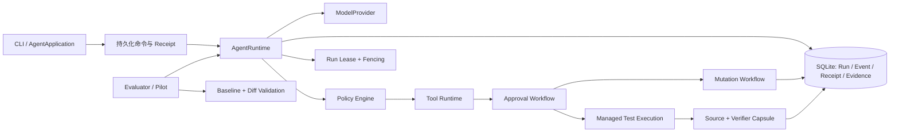

# AgentForge

**一个耐久、可审计、策略受控的代码修复 Agent Runtime。**

AgentForge 不把“模型能调用工具”当作终点。它关注更难、也更接近生产的问题：当 Agent
修改文件、运行测试、等待人工审批、进程崩溃或被另一进程接管后，系统还能否准确回答：
**发生了什么、谁拥有执行权、能否安全重试，以及最终结果是否可信。**

当前可复现产品基线是本地 tag [`a2-core-release`](docs/core-demo.md)：它提供可安装的
`agentforge` CLI，覆盖创建 Run、审批、副作用执行、新进程 `resume`、`inspect` 与最终
`VERIFIED` 验证。交互式对话（B）与证据发布（C）尚未开始。

## 它解决什么问题

一个代码修复 Agent 的难点通常不在“再调一次模型”，而在副作用与恢复边界：

- 同一个审批命令重放时，如何保证文件修改或测试不会执行两次？
- 进程在 provider 调用、文件发布或测试运行中断后，怎样给出 `COMPLETED`、`FAILED`、
  `INDETERMINATE` 或 `UNKNOWN` 的诚实结论？
- 两个进程同时试图恢复同一 Run 时，怎样阻止陈旧 worker 写入新状态？
- 修改后的 workspace、测试输入和最终验证结果怎样形成可审计证据，而不是一句“测试通过”？
- 评测统计怎样避免把不完整实验、历史结果或基础设施故障包装成模型能力？

AgentForge 把这些问题实现为明确的持久化状态机、策略、receipt、lease/fencing 和验证证据，
而不是依赖内存状态或“最佳努力”重试。

## 三分钟 Core CLI 演示

Core demo 使用本地 Mock provider，不需要 API key。它会创建临时 workspace，分别信任
development 与 verification profile，执行一次受审批的文件修复和测试，再由新的 CLI
进程批准并恢复同一个 Run，最后断言 `outcome=VERIFIED`。

```powershell
uv build
powershell -NoProfile -ExecutionPolicy Bypass -File ./scripts/demo_core.ps1
```

Linux/macOS shell：

```sh
uv build
sh ./scripts/demo_core.sh
```

恢复路径使用相同的跨进程语义：

```powershell
powershell -NoProfile -ExecutionPolicy Bypass -File ./scripts/demo_recovery.ps1
```

完整的安装前提、预期事件和退出码见 [Core CLI 演示手册](docs/core-demo.md)。面试与投递时，
建议按 [中文项目导读](docs/portfolio-guide.zh-CN.md) 的三分钟顺序演示。

## 演示视频

GitHub 录制版展示同一条公开 Core CLI 路径：trust、跨进程 approval/resume、测试与最终
`VERIFIED`。可直接[观看或下载 v0.1.1 Core CLI Demo（MP4）](https://github.com/hiaanoi/agentforge/releases/download/v0.1.1/agentforge-core-cli-demo-v0.1.1.mp4)，
也可访问 [v0.1.1 Release](https://github.com/hiaanoi/agentforge/releases/tag/v0.1.1)。

视频不提交到仓库历史；如需复现或审查素材，请先按[录制脚本与清单](docs/demo-recording.zh-CN.md)操作。

## 当前能力地图

### 耐久 Runtime 与模型执行

- Typed `Run`、checkpoint、budget、snapshot、event 与 command receipt，全部持久化在 SQLite；
- provider attempt journal 记录请求边界、重试、使用量与不确定结果，避免把未知外部调用误判为
  可安全重试；
- context compaction、loop detection、结构化工具结果和多工具策略，限制模型循环与上下文膨胀；
- `ModelProvider` 支持离线 Mock、受显式授权的 OpenAI Responses adapter，以及使用独立
  `DEEPSEEK_API_KEY` 的 DeepSeek Chat Completions adapter；远程 provider 均对输出、重试和用量
  进行边界控制。

深入设计：[架构说明](docs/architecture.md)、[Milestone 3 耐久审批与恢复报告](docs/milestone_03_report.md)、
[Milestone 4 模型与上下文报告](docs/milestone_04_report.md)。

### 受控工具、审批与 workspace mutation

- 本地只读工具 `list_files`、`read_file`、`search_text` 与 `get_git_diff` 被限定在 workspace
  内；`git_status` 与 `git_log` 额外绑定 Git 控制目录、配置、
  executable identity、环境和进程生命周期；
- `write_file`、`edit_file` 与 `run_tests` 是审批驱动的副作用，绑定目标、内容 hash、policy、
  approval 与执行记录；
- 文件发布使用原子写入；每次 mutation 绑定 source revision，预期内容或源码链漂移时 fail closed；
- receipt、短事务 claim 与 `RunLeaseAuthority` fencing 阻止重复执行和陈旧 worker 写入。

深入设计：[Milestone 5 安全 mutation 报告](docs/milestone_05_report.md)、
[安全模型](docs/security_model.md)。

### 测试、最终验证与证据

- `TestProfile` 是带 digest 与 purpose 的受信定义；development 测试与 final verification 不能
  互换使用；
- managed process 在 Windows 使用 Job Object、在 POSIX 使用 process group，输出和树生命周期都有
  上限；
- verification 会捕获 source/verifier capsule，并绑定 profile、source revision、测试输入与
  process evidence；在检测到漂移或不确定状态时不会给出 `VERIFIED`；
- product schema v9 对受管理表执行 exact topology 验证，损坏或缺失约束不会被自动“修复后继续”。

深入设计：[Milestone 6 测试执行报告](docs/milestone_06_report.md)、
[Milestone 7-A 修复评测报告](docs/milestone_07a_report.md)、[安全模型](docs/security_model.md)。

### 修复评测与 Pilot

- `RepairTaskPolicy`、workspace baseline 和 diff validator 将“修复成功”限定为策略允许的修改、
  测试与最终验证共同成立；
- evaluator 拥有 baseline、隐藏验证资产和专用 workflow，不把 evaluator-only 适配器暴露给产品
  assembly；
- 离线 Pilot 复用同一 Runtime、审批、mutation、测试和最终验证链；
- real-model Study 基础设施使用冻结 manifest、slot/replacement 语义、成本/attempt 事实和
  denominator-correct `pass@k` 报告，避免不完整实验伪装成评分结果。

深入设计：[评测指南](docs/evaluation_guide.md)、[7-B2.4 报告](docs/milestone_07b2_4_report.md)、
[实现历史索引](docs/implementation_plan.md)。

### 可安装的 A2 Core CLI

wheel 暴露 `agentforge` console script，并提供：

```text
exec       创建耐久代码修复 Run
inspect    查询 Run、审批和验证视图
doctor     只读诊断 workspace、配置与数据库
approvals  查询 pending approval
approve    批准一个副作用
reject     拒绝一个副作用
resume     在新进程继续一个 Run phase
trust      审阅或信任精确 TestProfile identity
```

配置、runtime definition、profile trust 与 product assembly 在启动前绑定；`doctor` 走 SQLite
只读路径，不创建数据库或 schema。CLI 的公开输出只渲染安全投影，不输出 secret、隐藏测试内容、
verifier 绝对路径或原始 provider 响应。

## 架构概览



阅读顺序：先看本 README 的能力地图；要理解数据流与状态机看
[架构说明（英文）](docs/architecture.md)；要理解投递时如何讲述项目看
[中文项目导读](docs/portfolio-guide.zh-CN.md)。

## 可核对的验证事实

`a2-core-release` 基线完成时，已验证的核心事实包括：

- 完整 unit suite：`1131 passed, 13 skipped`；
- A2 CLI/Application 核心门禁、fresh-wheel 安装与 Core/Recovery demo 均通过；
- Windows fresh-wheel demo 经跨进程审批和恢复后输出 `run_finished ... outcome=VERIFIED`；
- Ruff、mypy 与 `git diff --check` 通过；
- CI 配置覆盖 Windows/Linux 与 Python 3.11/3.14，并构建 wheel 后在新环境中 smoke test；
- 关键安全/规格修复经过独立审计，审计结果以对应提交、测试和报告为准。

这些是工程验证事实，不是公开 benchmark 排名。若需要追溯旧 milestone、offline Pilot 或
real-model Study 的具体范围，请从[评测指南](docs/evaluation_guide.md)、
[7-B2.4 报告](docs/milestone_07b2_4_report.md)和
[历史实现计划](docs/implementation_plan.md)开始。

## 证据口径（Evidence）

当前公开证据契约是 **schema v2**，使用 standard pass@k estimator：
`1 - C(n-c, k) / C(n, k)`。其中 `n` 是有效评分重复次数，`c` 是成功次数；只要
`n >= 1`，`pass@1 = c / n`。只有一个任务完整完成三次有效重复（`n = 3`）时，
`pass@3` 才有资格报告；第一槽是否成功单独称为 **first-attempt success**。

报告必须同时呈现 planned、executed、valid、invalid、scored、replacement 与 unexecuted
分母。未满足分母时指标为 **ineligible**，不能包装成完整结果。AgentForge 的评测来自
**curated** fixtures，是 **non-official** 工程证据，不是官方 SWE-bench 成绩。旧结果按
[legacy evidence policy](evaluation/results/LEGACY.md)保留，但不得作为当前 headline。
在形成完整、校验通过的 schema-v2 evidence bundle 前，项目不会发布新的真实模型结果。

## 当前边界

- verification runtime 标记为 `NON_HERMETIC`：它提供受控捕获、完整性重验和证据绑定，
  **不是** OS 级隔离沙箱，也不防御同账户高权限外部进程；
- Core demo 使用 Mock provider，只证明产品状态机和恢复路径，不构成真实模型能力、通用代码
  修复能力或官方 SWE-bench 成绩；
- 历史 real-model canary 或结果只能按各自冻结 manifest 与报告解释；未完成的 schema-v2 study
  不产生新的对外 headline score；
- 真实模型运行需要显式授权、独立凭据与成本预算；不得提交 `.env`、API key、私有 manifest、
  隐藏测试或原始 provider 数据；
- 当前产品入口是 CLI；多轮交互会话/REPL（B）和面向公开发布的完整证据包（C）仍是后续范围。
- 当前不提供 `arbitrary shell`、通用 `automatic bug repair`、`MCP server` 或 `web API`；
  除已实现的 OpenAI 与 DeepSeek 外，`additional model providers` 仍属于后续范围。

AgentForge 已支持 DeepSeek provider，并可把 base-commit-bound 补丁导出为官方 SWE-bench
prediction 格式。任何按当前路径产生的结果都只能表述为单实例 canary；它不是排行榜分数，也不
构成通用代码修复能力声明。完整云端步骤见
[DeepSeek + SWE-bench Canary 手册](docs/deepseek-swebench-canary.md)。

## 快速开始与开发验证

要求：Python 3.11+ 与 [uv](https://docs.astral.sh/uv/)；CI 覆盖 Python 3.11 与 3.14。

```powershell
uv sync --frozen
uv run --frozen pytest tests/unit -q
uv run --frozen ruff check src tests
uv run --frozen mypy src
uv build
```

离线测试不需要 API key。任何 live OpenAI 测试都必须显式启用，并使用临时 workspace：

```powershell
$env:RUN_LIVE_TESTS = "1"
$env:OPENAI_API_KEY = "<仅本地设置>"
$env:AGENTFORGE_OPENAI_MODEL = "<已授权模型>"
uv run --frozen pytest -m live -ra
```

## 文档导航

| 目的 | 阅读入口 |
| --- | --- |
| 30 秒理解项目、3 分钟演示、面试叙事 | [中文项目导读](docs/portfolio-guide.zh-CN.md) |
| 安装后运行公开 demo | [Core CLI 演示手册](docs/core-demo.md) |
| 核对 Runtime、审批、mutation、验证数据流 | [架构说明（英文）](docs/architecture.md) |
| 核对评测方法、失败分类和真实模型边界 | [评测指南](docs/evaluation_guide.md) |
| 运行 DeepSeek + SWE-bench 单实例 Canary | [云端 Canary 手册](docs/deepseek-swebench-canary.md) |
| 查阅 milestone 事实、旧报告与实施顺序 | [历史实现计划](docs/implementation_plan.md) |
| 查阅安全假设、威胁模型和不支持项 | [安全模型](docs/security_model.md) |
| 查阅 real-model Study 基础设施的当前范围 | [7-B2.4 报告](docs/milestone_07b2_4_report.md) |
| 查阅产品化阶段和后续 B/C 路线 | [产品化总计划](docs/superpowers/plans/2026-08-10-agentforge-productization-program.md) |

## 许可证与来源

许可证和第三方资产来源见 [`LICENSE`](LICENSE) 以及各 fixture 的 `ATTRIBUTION.md`。项目不发布
私有隐藏测试资产、secret 或原始 provider 数据。
