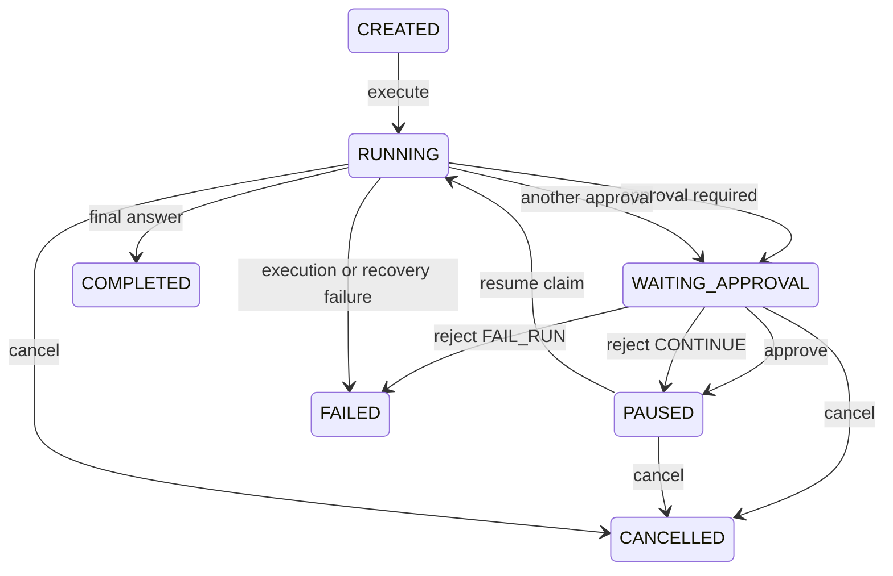

# Milestone 3: Durable Approval and Resume Design

## Status and scope

This design is approved for Milestone 3. It adds durable approval and resume behavior to the
single-process AgentForge core. It does not add FastAPI, a CLI, real model providers, write or
shell tools, MCP, LangGraph, evaluation infrastructure, or a frontend. Approval behavior is
verified with test-only local tools.

## Current architecture findings

- Approval-related Run states and EventType values exist, but no approval workflow uses them.
- `AgentRuntime.execute()` starts with empty history and cannot restore a checkpoint.
- Existing checkpoints store an unversioned history dictionary and cannot identify a pending call.
- `ToolExecutor` currently converts `REQUIRE_APPROVAL` into an ordinary failed ToolResult.
- Repository calls use separate transactions; conditional resume ownership and atomic cancellation
  need a dedicated persistence module.

## Chosen architecture

Use three distinct records:

1. `RuntimeSnapshot` is the versioned, executable recovery context.
2. `ApprovalRequest` is the durable approval fact and lifecycle.
3. Event rows are sanitized audit evidence, not recovery state.

`AgentRuntime` owns orchestration. `ToolExecutor` validates and executes a call but accepts only a
typed authorization bound to the persisted approval digest. A dedicated persistence workflow uses
short SQLite transactions for pause, decision, conditional claim, consumption, and cancellation.
No database transaction remains open while a tool or model is running.

## Domain model

### ApprovalRequest

- `approval_id: UUID`
- `run_id: UUID`
- `checkpoint_id: UUID`
- `tool_name: str`
- `sanitized_arguments: dict[str, JsonValue]`
- `request_digest: str`
- `status: PENDING | APPROVED | REJECTED | CANCELLED`
- `rejection_strategy: CONTINUE | FAIL_RUN`
- `consumption_state: NOT_STARTED | CLAIMED | CONSUMED | INDETERMINATE`
- `decision_note: str | None`
- `result_status: str | None`
- `result_summary: str | None`
- `requested_at`, `decided_at`, `consumed_at`

The Approval row never stores complete tool output. A bounded status/summary may be stored for
operations and audit. The complete ToolResult is persisted only in a post-decision checkpoint.

### RuntimeSnapshot

- `schema_version: Literal[1]`
- `run_id: UUID`
- `step_number: int`
- `history: list[JsonValue]`
- `pending_tool_call: ToolCall | None`
- `pending_approval_id: UUID | None`
- `tool_call_digest: str | None`
- `resume_phase: AWAITING_APPROVAL | READY_FOR_MODEL`

Pydantic validates every loaded snapshot. Run ID, step number, approval ID, tool name, and digest
must agree across the Run, snapshot, and Approval row. Missing, malformed, or unsupported snapshots
fail the Run explicitly; recovery never starts over with empty history.

### Deterministic request digest

The digest is SHA-256 over canonical UTF-8 JSON containing:

```text
tool_name
validated raw arguments
checkpoint_id
step_number
```

JSON uses sorted keys and stable separators. It is never computed from sanitized arguments.

## State transitions



`RUN_PAUSED` is emitted when entering `WAITING_APPROVAL`. `APPROVAL_GRANTED` or
`APPROVAL_REJECTED` accompanies the transition to `PAUSED`. `RUN_RESUMED` is emitted only after a
conditional resume claim succeeds.

## SQLite design

Add `approval_requests` with an Approval UUID primary key; Run and Checkpoint foreign keys; tool
name; sanitized JSON arguments; 64-character request digest; status, rejection strategy, and
consumption state; optional bounded result status/summary and decision note; and UTC timestamps.

Constraints and indexes:

- unique `(run_id, checkpoint_id)` prevents duplicate approval creation;
- index `(status, requested_at)` supports pending queries;
- conditional updates include the expected Approval and Run states.

Existing checkpoint JSON storage remains, but new M3 snapshots use `RuntimeSnapshot`. Legacy M1/M2
history-only checkpoints are not resumable approval snapshots and fail explicit M3 recovery
validation. Schema migration tooling remains out of scope; tests create fresh temporary databases.

## Runtime interface

```python
def list_pending_approvals(run_id: UUID | None = None) -> list[ApprovalRequest]: ...
def approve(approval_id: UUID, note: str | None = None) -> ApprovalRequest: ...
def reject(
    approval_id: UUID,
    strategy: RejectionStrategy = RejectionStrategy.CONTINUE,
    note: str | None = None,
) -> ApprovalRequest: ...
async def resume(run_id: UUID) -> Run: ...
def cancel(run_id: UUID, reason: str | None = None) -> Run: ...
```

- Repeating the same approval decision returns the persisted request unchanged.
- Changing an already resolved decision raises `ApprovalDecisionConflictError`.
- `reject(CONTINUE)` never executes the tool. Resume appends a structured `APPROVAL_REJECTED`
  ToolResult to history and lets the model choose another action.
- `reject(FAIL_RUN)` atomically records rejection and fails the Run.
- COMPLETED, FAILED, and CANCELLED Runs reject resume.
- Re-resuming a consumed approval never executes its tool again. A terminal Run still raises the
  terminal resume error; a recoverable RUNNING Run continues only from its READY_FOR_MODEL snapshot.

## Conditional claim and crash behavior

Resume ownership is acquired with a conditional SQLite UPDATE from `NOT_STARTED` to `CLAIMED`,
paired with the expected Run transition from `PAUSED` to `RUNNING`. Only the caller whose UPDATE
changes one row may process the decision. The transaction commits before tool execution.

After a result is available, a short transaction writes a READY_FOR_MODEL checkpoint containing
the complete structured result and changes `CLAIMED` to `CONSUMED`. Model execution occurs only
after that transaction commits.

Crash windows:

1. **Decision persisted, resume not called:** after rebuilding Runtime, the approval and AWAITING
   snapshot are loaded normally and can be claimed.
2. **Claim persisted, approved tool result absent:** a rebuilt Runtime changes the legacy CLAIMED
   request to INDETERMINATE and fails the Run. It never retries a possibly side-effecting tool.
   A claimed rejected decision is safe to reconstruct because no tool executes.
3. **Tool result checkpoint persisted, next model call absent:** the request is CONSUMED and the
   snapshot is READY_FOR_MODEL. A rebuilt Runtime restores history and continues with the model
   without executing the tool again.

An in-memory active-Run guard prevents concurrent resume calls inside one Runtime instance. SQLite
conditional updates provide the durable ownership check. Distributed leases are not introduced.

## Cancellation

Cancellation uses one short transaction to transition an eligible Run to CANCELLED, cancel its
PENDING or resolved-but-unconsumed Approval, and append `RUN_CANCELLED`. A cancelled approval can
never be claimed or consumed. Repeating cancel on a CANCELLED Run is a no-op returning the current
Run; COMPLETED and FAILED Runs reject cancellation.

## Testing strategy

Tests use temporary SQLite databases, MockModelProvider, and test-only local approval tools. They
cover domain transitions, repository reopen, conditional claims, decision conflicts, default and
fail-fast rejection, all three crash windows, corrupt/missing checkpoints, cancellation, duplicate
resume, tool exactly-once behavior, multiple-Run isolation, and complete M0/M1/M2 regression.

## Known limits

Exactly-once external side effects are impossible without cooperation from the tool. M3 guarantees
that a persisted CLAIMED call with unknown outcome is not automatically retried. SQLite workflow
transactions are short and local; distributed workers, leases, schema migrations, and recovery of
arbitrary legacy checkpoints remain future work.
