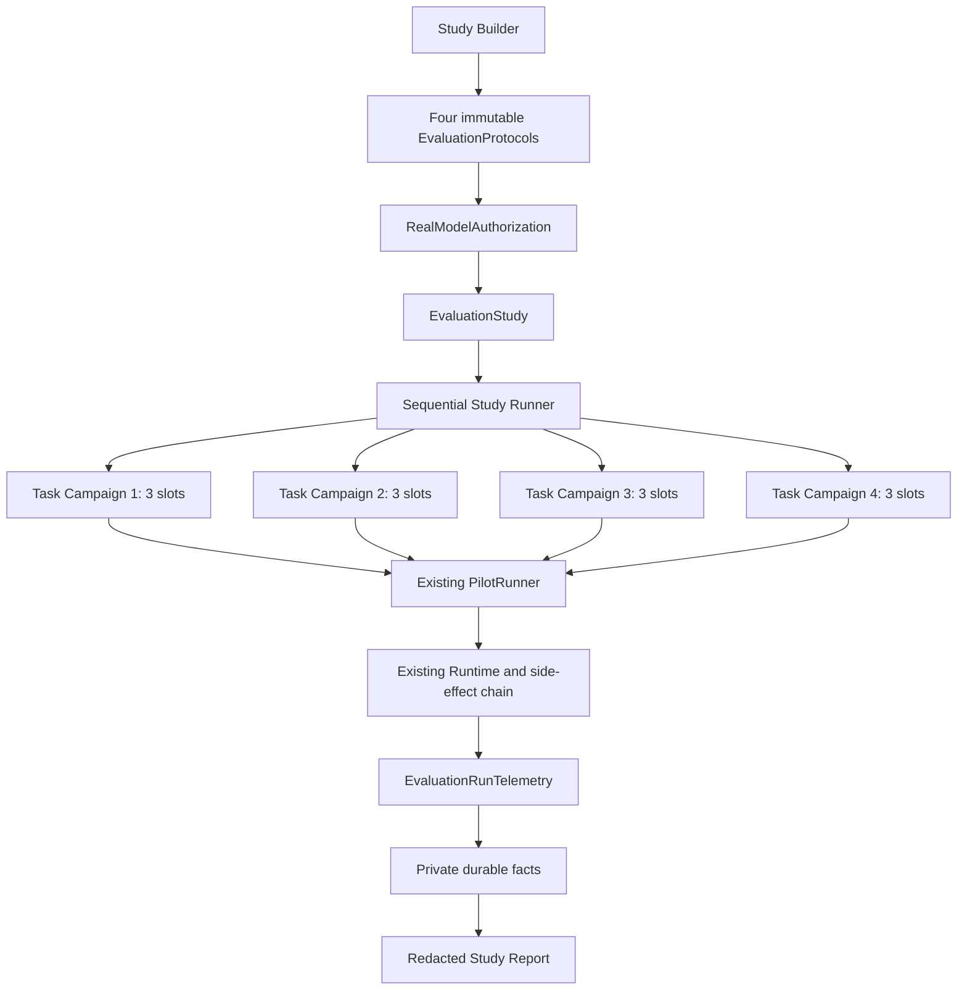

# Milestone 7-B2.4 Design: Real-Model Portfolio Pilot

## Decision

Milestone 7-B2.4 will execute a small, frozen, real-model Portfolio Pilot across all four
already-admitted formal Fixtures:

1. `quixbugs-shortest-path-length`
2. `bugsinpy-black-21`
3. `swebench-pytest-10051`
4. `self-durable-double-consumption`

Each task receives three predeclared repetitions, for 12 planned scoring slots. Every task keeps
its own immutable `EvaluationProtocol` and durable `EvaluationCampaign`. A new evaluator-owned
`EvaluationStudy` binds the four Protocols into one authorized, sequential, restart-safe study.

This is an AgentForge Portfolio Pilot. It is not an official SWE-bench, BugsInPy, or QuixBugs
benchmark score.

## Why This Scope

Three approaches were considered:

| Approach | Benefit | Problem | Decision |
| --- | --- | --- | --- |
| One task x three repetitions | Lowest cost and reuses B2.3 directly | Too narrow to support a credible real-model project claim | Reject |
| Four tasks x three repetitions | Covers two difficulty levels, four bug types, repeated stochastic behavior, and the complete existing Fixture set | Requires a small Study layer and stronger reporting | **Adopt** |
| Large upstream benchmark | Stronger external comparability | Requires containers, dependency installation, hostile-repository isolation, and a much larger budget | Defer |

The adopted scope is large enough to expose model behavior but remains within the reviewed,
offline, fixed-profile safety boundary built in M5-M7.

## Goals

1. Prove that the existing real OpenAI Adapter can drive the complete constrained repair chain.
2. Run 12 fresh, protocol-bound scoring slots without manual intervention.
3. Keep model-quality failures in the denominator.
4. Permit replacement only for explicitly classified infrastructure failures.
5. Persist enough telemetry to report tool behavior, retries, tokens, latency, and cost estimates.
6. Produce a redacted, reproducible public report bound to source, dependency, platform, Fixture,
   Provider, Prompt, Tool schema, policy, and pricing digests.
7. Preserve B2.3 durability, approval, side-effect, hidden-test, and fail-closed guarantees.

## Non-Goals

- No Prompt tuning after a formal Study starts.
- No new repair Tool, arbitrary shell, dependency installation, Git mutation, or network Tool.
- No change to visible or hidden tests, reference overlays, task descriptions, or fixed budgets.
- No FastAPI, product CLI, frontend, MCP, LangGraph, RAG, Memory, or Multi-Agent.
- No parallel task execution.
- No claim of deterministic model behavior or Provider-side exactly-once requests.
- No official upstream benchmark score.
- No automatic publication of raw SQLite data, model text, source text, diffs, test output,
  Provider request IDs, environment maps, or secrets.

## Existing Components Reused

B2.4 must reuse these components rather than create a second execution path:

- `FormalFixtureLoader`
- `PilotWorkspaceManager`
- `EvaluationProtocol` and `EvaluationProtocolRepository`
- `PilotRuntimeFactory`
- `OpenAIEvaluationProviderFactory`
- `PilotRunner`
- evaluator-owned visible baseline execution
- `AgentRuntime`
- constrained AutoApproval
- `MutationCoordinator`
- M6 managed Test Execution
- `WorkspaceDiffValidator`
- evaluator-owned hidden final verification
- Campaign/Slot/Attempt recovery and replacement chains

## Architecture



The Study layer orchestrates existing Campaigns. It does not execute Tools or call the Provider
directly.

## Study Definition

`EvaluationStudyDefinition` is immutable and digest-bound. It contains:

- `schema_version`
- `study_name`
- ordered `task_ids`
- ordered `protocol_digests`
- `provider_configuration_digest`
- `model_id`
- `repetitions_per_task=3`
- `planned_scoring_slots=12`
- `runtime_source_digest`
- `git_commit_sha`
- `git_worktree_clean=true`
- `pyproject_sha256`
- `uv_lock_sha256`
- `fixture_registry_digest`
- `platform_binding_digest`
- `pricing_snapshot_digest`
- fixed sequential task order
- `definition_digest`

The four Protocols must share the exact Provider binding, System Prompt version, Context Policy,
Tool schema generation code, completion-correction mode, and platform binding. Task-specific
Fixture, task Prompt, Tool schema, TestProfile, and RepairTaskPolicy digests remain distinct.

## Explicit Authorization

Real execution requires all of the following:

1. Every Protocol uses `execution_mode=REAL_MODEL`.
2. Every Protocol has `real_model_authorized=true`.
3. An immutable `RealModelAuthorization` references the exact Study definition digest and all four
   Protocol digests.
4. `RUN_REAL_MODEL_PILOT=1` is present in the parent evaluator process.
5. `OPENAI_API_KEY` is supplied only as a runtime secret.
6. The operator passes the exact Study definition digest to the execution command.
7. The checked source tree is clean and still matches the bound source and dependency digests.

The API key must never enter a Pydantic dump, SQLite row, Event, checkpoint, command argument,
report, exception message, or test-process environment.

The authorization records a maximum of four Campaigns, 12 planned scoring slots, one
infrastructure replacement per slot, and the frozen request/token envelope. Authorization does not
mean a repair is expected to succeed.

## Protocol Settings

All four Protocols use one account-accessible exact OpenAI model ID supplied by the evaluator and
captured before registration. A formal Study cannot mix model IDs.

Common Provider settings:

| Setting | Value |
| --- | --- |
| `store` | `false` |
| `parallel_tool_calls` | `false` through the existing Adapter |
| multi-tool policy | `SEQUENTIAL_READ_ONLY` |
| maximum function calls per response | `8` |
| physical retry count | `1` |
| request timeout | `90` seconds |
| maximum output tokens per request | `4000` |
| completion correction | `DEFAULT` |
| Context maximum items | `100` |
| Context maximum characters | `20000` |
| Context maximum UTF-8 bytes | `40000` |

Task policy budgets remain fixed by difficulty:

| Difficulty | Logical model calls | Reads | Edits | Development tests | Wall time |
| --- | ---: | ---: | ---: | ---: | ---: |
| BASIC | 6 | 20 | 2 | 3 | 300 seconds |
| ENGINEERING | 10 | 35 | 4 | 5 | 600 seconds |

The physical model-request budget includes one possible retry for every logical call:

| Difficulty | Max physical requests | Max input tokens | Max output tokens | Max total tokens |
| --- | ---: | ---: | ---: | ---: |
| BASIC | 12 | 50000 | 10000 | 60000 |
| ENGINEERING | 20 | 85000 | 15000 | 100000 |

Retries can consume the physical request budget but cannot increase the RepairTaskPolicy logical
model-call budget.

## Study State Machine

`EvaluationStudyStatus`:

- `DRAFT`
- `AUTHORIZED`
- `RUNNING`
- `COMPLETED`
- `COMPLETED_WITH_INFRASTRUCTURE_GAPS`
- `ABORTED_CONFIGURATION`
- `INDETERMINATE`

Transitions:

```text
DRAFT -> AUTHORIZED
AUTHORIZED -> RUNNING
RUNNING -> COMPLETED
RUNNING -> COMPLETED_WITH_INFRASTRUCTURE_GAPS
RUNNING -> ABORTED_CONFIGURATION
RUNNING -> INDETERMINATE
```

Terminal states are immutable.

Meaning:

- `COMPLETED`: all 12 planned slots produced score-eligible results. Those results may all fail.
- `COMPLETED_WITH_INFRASTRUCTURE_GAPS`: at least one slot remained unscored after its allowed
  infrastructure replacement.
- `ABORTED_CONFIGURATION`: authentication, unsupported model, bad request, source drift, or
  authorization mismatch invalidated the Study. Remaining repetitions in the current Campaign and
  all later Campaigns are not started.
- `INDETERMINATE`: a side effect or recovery state cannot be proven. Execution stops, the
  investigative workspace is retained, and no final quality score is published.

## Outcome Classification

The current B2.3 `infrastructure_failure` Boolean is insufficient for a fair real-model Study.
B2.4 introduces `EvaluationOutcomeClass`:

- `SCORED`
- `INFRASTRUCTURE_INVALID`
- `INDETERMINATE`

`SCORED` includes both verified success and model-quality failure.

### Scored outcomes

These outcomes consume a planned slot and are never replaced:

- `VERIFIED_SUCCESS`
- `TESTS_FAILED`
- `FINAL_VERIFICATION_FAILED`
- `UNVERIFIED_FINAL`
- `BUDGET_EXHAUSTED`
- `POLICY_BLOCKED`
- `DIFF_POLICY_VIOLATION`
- `LOOP_DETECTED`
- exhausted `MODEL_PROTOCOL_ERROR`
- invalid structured model output

A multi-tool STRICT deviation that still fails after the frozen physical retry is a scored
protocol failure, not free infrastructure replacement.

### Replaceable infrastructure outcomes

At most one replacement is allowed per slot for:

- `MODEL_RATE_LIMITED`
- `MODEL_TIMEOUT`
- `MODEL_TRANSPORT_ERROR`
- retryable `MODEL_PROVIDER_ERROR`
- `BASELINE_LAUNCH_FAILURE`
- `BASELINE_TIMEOUT`
- `PILOT_PREPARATION_ERROR`
- `PILOT_RECOVERY_INTERRUPTED` when no side effect became uncertain
- `WORKSPACE_PREPARATION_ERROR`

All attempts, including replaced attempts, remain in raw metrics.

### Configuration aborts

These do not trigger repeated formal calls:

- `MODEL_AUTH_ERROR`
- `MODEL_BAD_REQUEST`
- model-response identity mismatch
- authorization or digest mismatch
- dirty or drifted source/dependency state

### Indeterminate outcomes

These stop the Study and prohibit automatic replacement:

- approval left `CLAIMED` without a terminal execution fact
- mutation left `WRITING`
- process left `STARTED`
- baseline left `STARTED`
- missing or conflicting persisted result bindings
- an otherwise uncertain side effect

## Execution Flow

### Phase 1: offline acceptance

1. Require a clean Git worktree.
2. Run the complete offline suite and static checks.
3. Run the four-Fixture verifier with three fresh repetitions.
4. Verify source, dependency, Fixture, Python executable, and platform digests.

### Phase 2: Provider smoke preflight

1. Use the existing generated read-only temporary Fixture.
2. Verify authentication, model identity, Tool schema acceptance, usage reporting, timeout policy,
   and sanitized Provider metadata.
3. Do not use any formal repair Fixture.
4. Persist the smoke result separately and exclude it from Study metrics.

### Phase 3: freeze

1. Build four task Protocols from the unchanged manifests.
2. Build the Study definition and pricing snapshot.
3. Render a review pack containing only safe configuration and digests.
4. Create the explicit authorization against the exact Study digest.
5. Register all four Protocols and all four Campaigns before the first formal model request.

### Phase 4: formal execution

Execute Campaigns sequentially in the fixed task order. Each Campaign runs its three repetitions
through the existing `PilotRunner`. A model-quality failure completes and selects its slot.
Infrastructure failure follows the frozen replacement policy. Configuration or indeterminate
failure stops the Study.

No Prompt, budget, model setting, Tool schema, Fixture, policy, or test may change after the first
formal request. Any change requires a new Study definition and new Study ID.

### Phase 5: publication

1. Reconcile all Study and Campaign states.
2. Collect immutable run telemetry from persisted model attempts, Events, approvals, mutations,
   process records, and evaluation results.
3. Generate a private audit report and a separately redacted public report.
4. Run a forbidden-content scan over every public artifact.
5. Record the final Git commit and tag only after code/tests/documents pass.

## Durable Telemetry

`EvaluationRunTelemetry` is a one-to-one immutable fact bound to `evaluation_run_id`, `run_id`,
`attempt_id`, and `protocol_digest`.

It records:

- logical model calls
- physical model requests
- completed and failed physical requests
- retry count
- input, output, total, cached-input, and reasoning tokens
- successful Provider latency total and maximum
- approximate end-to-end model-attempt duration
- model protocol failure count
- Provider deviation count
- normalized multi-tool response count
- returned and discarded function-call counts
- Tool requested/completed/failed counts
- READ, mutation, and managed-test counts
- approval requested/granted/rejected counts
- context compaction count
- completion-correction count
- policy-violation count
- telemetry schema version and digest

Telemetry contains no raw Tool arguments, source, output, prompts, diffs, Provider request IDs, or
absolute paths.

Telemetry is regenerated idempotently from durable source facts if a crash occurs after the
evaluation result is saved but before telemetry is saved.

## Cost Reporting

Dollar cost is an estimate, not a Provider invoice. A `PricingSnapshot` binds:

- exact model ID
- requested model alias and exact response Snapshot ID
- currency
- effective date
- source URL
- price per million uncached input tokens
- price per million cached input tokens
- price per million output tokens
- pricing digest

Estimated cost is calculated only when Provider usage is complete. Cached input tokens are treated
as a subset of input tokens:

```text
uncached_input = max(0, input_tokens - cached_input_tokens)
estimated_cost =
    uncached_input * input_rate
    + cached_input_tokens * cached_input_rate
    + output_tokens * output_rate
```

Rates are divided by one million. Reasoning tokens are reported separately but not billed a second
time when already included in output usage.

If usage or a required rate is absent, the report sets `cost_complete=false` and does not invent a
value.

## Metrics

### Per task

- planned slots
- score-eligible slots
- infrastructure-invalid slots
- verified-success count
- scored success rate
- planned-slot success rate
- majority, stable, and any-success indicators
- mean logical model calls
- mean physical requests and retries
- mean reads, edits, and development tests
- median wall time
- token totals and mean tokens
- estimated cost
- Provider-deviation and multi-tool normalization rates
- policy-block, budget-exhaustion, protocol-error, visible-test-failure, and hidden-test-failure
  rates
- complete failure distribution

### Whole Study

- `12` planned slots
- scoring coverage: score-eligible slots / planned slots
- micro scored success rate: successes / score-eligible slots
- conservative planned-slot success rate: successes / planned slots
- task any-success count / 4
- task stable-success count / 4
- total logical calls, physical requests, retries, tokens, wall time, and estimated cost
- raw infrastructure attempt count and replacement count
- complete model-quality and infrastructure failure distributions

The public report must display all three denominators: planned, score-eligible, and successful.

## Public Artifact Contract

Tracked public artifacts may contain:

- Study and Protocol digests
- task IDs and source categories
- exact model ID
- safe Provider settings
- Python/OS versions
- source/dependency digests and Git commit
- statuses, counts, durations, token usage, cost estimate, and failure categories
- final workspace and diff digests

They must not contain:

- API keys, tokens, secrets, or environment maps
- prompt text
- source or test contents
- complete model output
- Tool arguments or Tool output
- complete diffs
- hidden-test names, output, paths, or failure details
- Provider request IDs
- absolute local paths
- raw SQLite data

Raw execution databases and retained investigative workspaces stay ignored and local.

## Recovery Semantics

- Restart before a Campaign starts: continue with the next unstarted Campaign.
- Restart after Campaign creation but before a slot claim: claim normally.
- Restart with an active Campaign: call existing explicit `recover_campaign`.
- Result persisted before Attempt finalization: validate and reuse it.
- Telemetry missing after result persistence: regenerate it from durable facts.
- Report missing after Study completion: regenerate it without model calls.
- Provider request in flight at process crash: no Provider-side exactly-once guarantee; recover
  only under the existing side-effect-aware rules.
- Any ambiguous mutation, process, approval, or baseline state: Study becomes `INDETERMINATE`.
- Re-running a terminal Study performs no Provider or Tool call and returns the persisted report.

## Security Invariants

1. The only network action is the bound OpenAI Provider request.
2. Model Tools remain local and constrained.
3. Test processes inherit only the fixed TestProfile environment.
4. `OPENAI_API_KEY` never enters TestProfile `allowed_env`.
5. All writes and test runs keep durable approval and digest binding.
6. Hidden tests remain evaluator-owned and final-only.
7. Reference overlays never enter the model workspace or Context.
8. Public report generation is deny-by-default for unknown fields.
9. Infrastructure replacement cannot replay an indeterminate side effect.
10. Study execution is sequential.

## Acceptance Criteria

Implementation acceptance:

- all new offline unit/integration/security tests pass;
- the existing 500-test baseline continues to pass;
- Fixture verification remains 4 tasks x 3 repetitions with no unexpected result;
- Ruff, strict mypy, compileall, and `git diff --check` pass;
- no default test makes a network request;
- no dependency or `uv.lock` change is required.

Real-model acceptance:

- Provider smoke preflight passes (recorded separately from Study metrics);
- four immutable Protocols and one Study definition are reviewed and authorized;
- 12 planned slots execute or reach an explicitly reported infrastructure/indeterminate outcome;
- every model-quality failure remains counted;
- public JSON and Markdown reports pass forbidden-content scanning;
- rerunning the terminal Study causes zero new Provider and Tool calls;
- the final report states the small-sample and non-official-benchmark limitations.

Milestone status is:

- **PASS** only when the Study is `COMPLETED` and all 12 slots are score-eligible;
- **PARTIAL** when it is `COMPLETED_WITH_INFRASTRUCTURE_GAPS`;
- **BLOCKED** for configuration failure;
- **INDETERMINATE** for ambiguous side effects.

No minimum success rate is required for Milestone integrity. A 0/12 model result can still prove
that the evaluation system worked correctly, but it cannot support a positive repair-quality
claim.

## Remaining Technical Debt After B2.4

- Four cropped Fixtures are not an upstream benchmark.
- Three repetitions per task are too small for strong statistical conclusions.
- Only one Provider/model/account/environment is compared.
- Provider model aliases may change server-side even when the requested ID is recorded.
- Pricing snapshots can diverge from the final invoice.
- SQLite schema migrations and distributed Study workers remain absent.
- Windows is the locally accepted platform; POSIX acceptance still requires a POSIX host.
- TestProfile process control is not an OS sandbox.
- Provider-side request exactly-once remains impossible across a crash.
